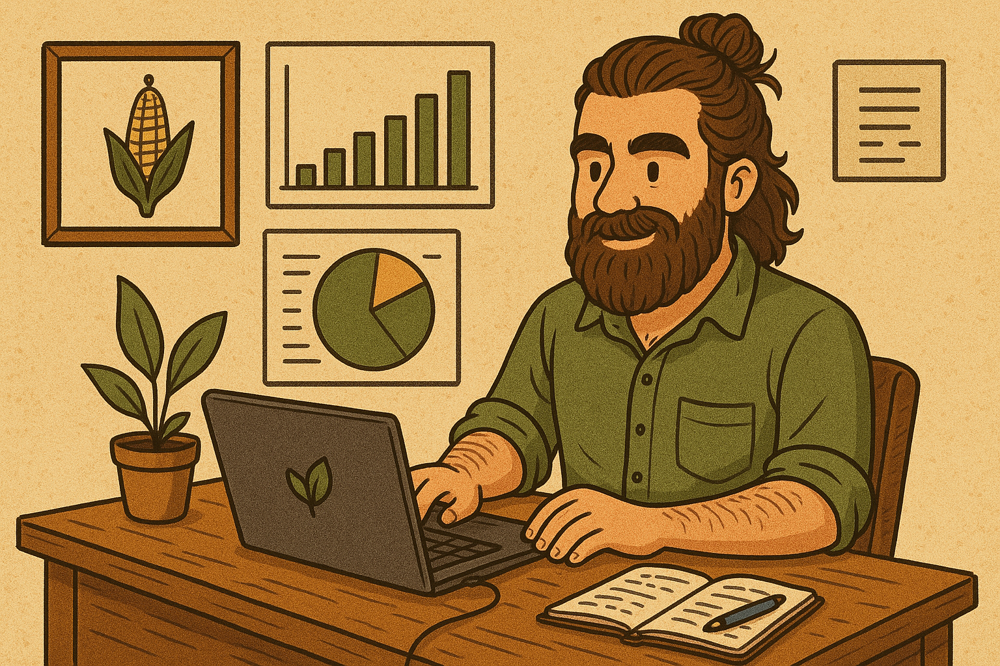

    

<small>Imagen generada por la inteligencia artifical DALL-E 

 

# **Español (English below)**

Este repositorio tiene como principal objetivo **aprender**... y para aprender, hay que hacer, ¿no?  
Pues, como parte de este aprendizaje, aquí iré subiendo diferentes proyectos que no forman parte de ningún curso ni formación reglada, sino como algo personal.

Si has llegado hasta aquí, muy probablemente ha sido a través de mi [LinkedIn](https://www.linkedin.com/in/pepereina/) o de mi currículum.  
Así que ya sabrás que soy **ingeniero agrícola** (sí, eso explica la imagen de la portada 😄). Pero tranquilo, no seré monotemático; **no todos los proyectos estarán relacionados con la agricultura**.

Siéntete libre de usar cualquier imagen, código, idea o lo que sea que encuentres en este repositorio.  
Y si necesitas algo, no dudes en preguntar.

¡Gracias por tu atención!

---

# English version

This repository was created with the main goal of **learning**... and to learn, you have to build, right?  
So, as part of this learning process, I’ll be uploading different projects here—none of which are part of any course or formal training, just personal work.

If you’ve ended up here, chances are you came through my [LinkedIn](https://www.linkedin.com/in/pepereina/) or my resume.  
So you probably know I’m an **agricultural engineer** (yep, that explains the cover image 😄). But don’t worry, I won’t be monothematic; **not all of these projects will be related to agriculture**.

Feel free to use any image, code, idea, or anything else you find in this repository.  
And don’t hesitate to reach out if you need anything.

Thanks for stopping by!
